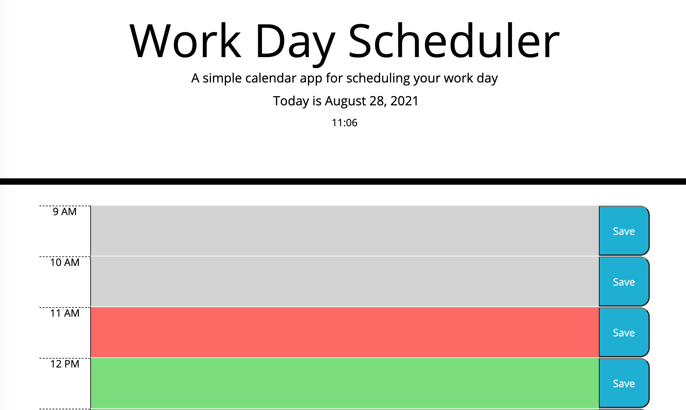

# WorkDayScheduler
Link: https://edgaro93.github.io/WorkDayScheduler/

## Description

This WorkDayScheduler was created with Javascript, jQuery and APIs such as Bootstrap. This website is will help people with a busy work day schedule to manage their time by hour effectively. The planner has the date and time. Each timeblock will change color depending on what time it is. If the timeblock is in the past it will turn gray, if in the present hour it will turn salmon , and if in the future it will turn green. Each task can be typed in each timeblock and you can save that task. That task if saved will stay on the site even if page is refreshed. This project let me learn more about jQuery and using APIs. For future updates, I would like to split the time blocks into minutes and add a clear function.

## Screenshot

## Acknowlegments
~~~
I would like to thank my tutor as well online resources such as W3 schools, MDN Web Docs, and Stack Overflow.
~~~
